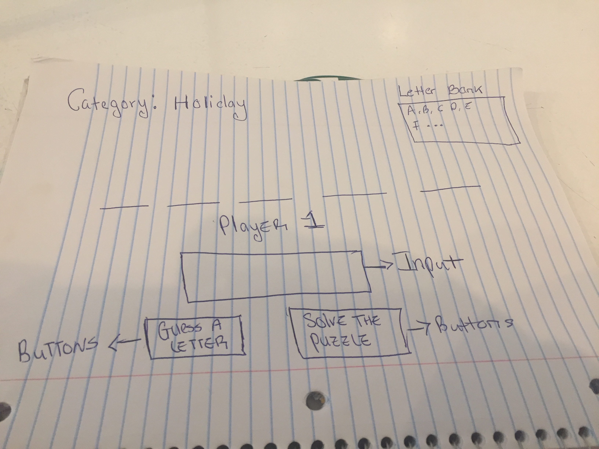

#  Project #1: The Game

#### Overview

Link TO Game

file:///Users/maryanneleanya/General_Assembley/sei/Unit-1-Project/landing.html

Technology Used

For this game of HangMan, Front-end languages such as CSS, HTML and JavaScript were used.

Approach Taken

In order to create this game of hangman I created a function that analyzes users inputs for both words and letters. The input was then compared against an array that consisted of the guessed words. Another thing that was included in the game was its multi-player functionality. Users of up to 3 can input different responses and have their responses mapped to a point value before the timer runs out. This makes the game exciting  and also allows for group bonding. An unsolved problem that I has was trying to getthe game to switch between categories. However, this was listed in my post MVP and it is something that I plan to address in the future.
